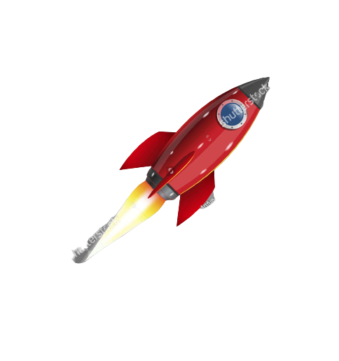
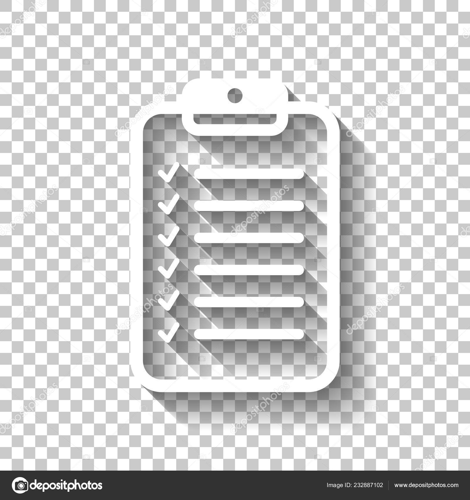

# Getting Started with luxExperience Movies Frontend 

` This is a simple guide to help you get this application up and running as soon as 
possible, it does not in any way take the place of the app's documentation`

Follow these instructions to get `luxExperience Movies` project up and running on your local machine

<!--  # Requirements -->

##  Requirements.

- `Node.js` (version 22.x or higher)
- `NPM` (included with Node.js)

##  Installation and Usage.

- Clone the repository [GitHub repo for luxexperience movies](https://github.com/Klasss4Web/luxExperience-movies)
- Run `npm install` to install all dependencies.
- Run `npm run dev` to start the development server. You will see `SSR server running at http://localhost:5173` on your terminal
- Open [http://localhost:5173/](http://localhost:5173/) to view it in your browser.
- To serve the project for production, simply run
- You will need one environment variables to run this app successfully
  - VITE_TMDB_API_KEY
```
npm run build
npm run preview
```

##  Tools and Technologies Used.

## By design, this project is meant to be SSR first and the following tools were used to achieve these goals

- Vite - This project was bootstrapped with [Vite](https://vitejs.dev/guide/).
- SSR is used for both the home page and the details page while CSR is used for the wishlist page (where it doesnt make sense to use SSR)
- React - The web library used for building the user is interface [React.js](https://react.dev). All codes were written in `Typescript`
- CSS - All styles were done using pure CSS with no external CSS library: A CSS first approach was also applied for styling. Keeping JavaScript away where CSS can do the job.
- React Router - Routings were done with `React Router` `createMemoryRouter` and `createBrowserRouter` were both used for both SSR and CSR
- Session storage - Session storage for persisting the wishlist items
- Browser fetch api - All `API` calls were made using `fetch`,which is inbuilt in browser and no extra cost as against axios

##  Acknowledgements.

- The `Vite` team for creating a fast and efficient build tool
- The `React` community for their continuous support and resources
- The `React Router` team for creating such a robust routing system that supports both SSR and CSR in one project
- `themoviedb.org` Team for the consistent and robust APIs provided to give this app a solid memory and useful data
- `luxExperience` Team for the opportunity to be part of this exercise

- Feel free to reach out to me via `eochade15@gmail.com` if you encounter any problem with running this project or in need of any further clarification. I would be a delight to be of help...

# Enjoy your time with luxExperience movies 
